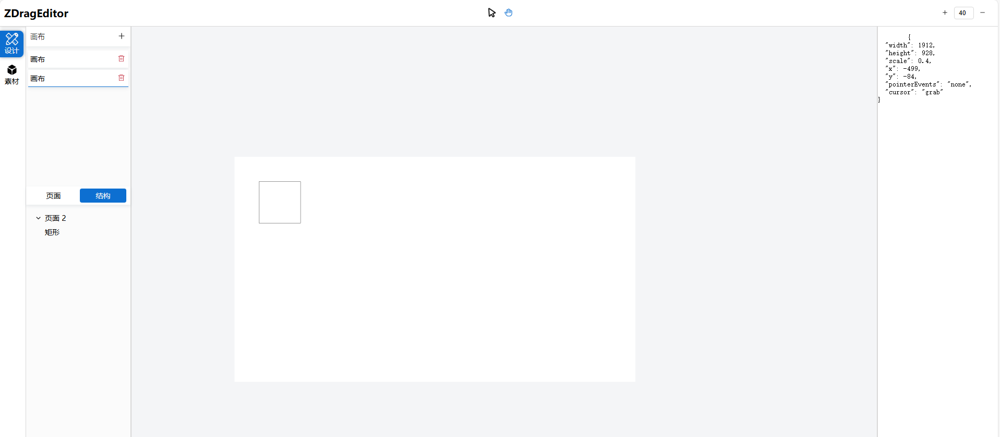

# Z-Drop-Editor

<div align="center">


一个基于 Vue 3 的拖拽编辑器组件库，提供丰富的拖拽编辑功能和组件。

</div>

<div align="center">
  <a href="https://gitee.com/salted-fish-333/z-drop-editor" target="_blank">
    
  </a>
  <a href="https://github.com/Saltedfish117/z-drop-editor" target="_blank">
    
  </a>
</div>


---

## 目录

- [特性](#特性)
- [安装](#安装)
- [快速开始](#快速开始)
- [主要组件](#主要组件)
  - [ZDragEditor](#zdrageditor)
  - [ZDrag](#zdrag)
  - [其他组件](#其他组件)
- [高级配置](#高级配置)
  - [自定义渲染组件](#自定义渲染组件)
  - [自定义工具栏](#自定义工具栏)
  - [自定义菜单](#自定义菜单)
  - [自定义右键菜单](#自定义右键菜单)
- [工具函数](#工具函数)
- [类型定义](#类型定义)
- [使用场景](#使用场景)
- [常见问题](#常见问题)
- [完整示例](#完整示例)
- [贡献指南](#贡献指南)
- [许可证](#许可证)

---

## ✨ 特性

- 🎨 **丰富的拖拽编辑功能**：支持拖拽、缩放、旋转、对齐等操作
- 🧩 **组件化设计**：所有功能都是独立的组件，可按需使用
- 🔧 **高度可定制**：支持自定义渲染、自定义工具栏、自定义菜单等
- 📱 **响应式设计**：适配不同屏幕尺寸
- 🚀 **基于 Vue 3**：充分利用 Vue 3 的 Composition API 和 TypeScript
- 📦 **开箱即用**：提供完整的编辑环境和预设组件
- 🛠️ **丰富的工具函数**：提供常用的节点、画布创建与操作工具函数
- 📝 **完整的类型定义**：提供完整的 TypeScript 类型定义，便于二次开发

---

## 📦 安装

```bash
npm install z-drop-editor
```

### 全局注册（必须）

> ⚠️ 本组件库**必须通过全局注册**，不支持按需引入。请在入口文件（如 `main.ts` 或 `main.js`）中使用 `app.use` 安装：

```typescript
import { createApp } from 'vue'
import App from './App.vue'
import ZDropEditor from 'z-drop-editor'
import 'z-drop-editor/style' // 引入样式

const app = createApp(App)
app.use(ZDropEditor)
app.mount('#app')
```

注册后即可在任意组件中直接使用 `<ZDragEditor />`、`<ZDrag />` 等组件。

---

## ⚡️ 快速开始

最小可运行示例：

```vue
<template>
  <div class="editor-container">
    <ZDragEditor
      v-model:canvases="canvases"
      :components="components"
      :renderNode="'CustomNode'"
    />
  </div>
</template>

<script setup>
import { ref } from 'vue'
import { createCanvas, createNode } from 'z-drop-editor'

const canvases = ref([createCanvas('main-canvas')])
const components = ref([
  createNode({
    id: 'node-1',
    label: '组件1',
    type: 'component',
    component: 'ZComponent1',
    relative: 'canvasId',
    canvasId: 'main-canvas'
  })
])
</script>

<style>
.editor-container {
  width: 100%;
  height: 100vh;
}
</style>
```

---

## 🚀 主要组件

### ZDragEditor

> 拖拽编辑器主组件，提供画布、工具栏、菜单等完整编辑环境。

#### Props

| 属性名            | 类型              | 默认值 | 说明                 |
|-------------------|-------------------|--------|----------------------|
| `components`      | `ZDragNodes`      | -      | 可用的组件列表       |
| `menus`           | `ZMenus`          | 见下   | 左侧菜单配置         |
| `canvasExtension` | `CanvasExtension` | `{}`   | 画布扩展配置         |
| `splitter`        | `Object`          | `{ leftHidden: false, rightHidden: false, leftMinWidth: 200, rightMinWidth: 200 }` | 分割器配置 |
| `canvases`        | `ZCanvasList`     | -      | 画布列表，必填       |
| `renderNode`      | `string`          | -      | **强烈推荐**：自定义渲染节点的组件名称，用于添加自定义属性和动画效果 |

#### 插槽

| 插槽名           | 说明                   |
|------------------|------------------------|
| `toolbar`        | 自定义工具栏           |
| `toolbar-left`   | 工具栏左侧内容         |
| `toolbar-center` | 工具栏中间内容         |
| `toolbar-right`  | 工具栏右侧内容         |
| `left`           | 左侧面板内容           |
| `center`         | 中间画布内容           |
| `right`          | 右侧面板内容           |
| `contextMenu`    | 右键菜单内容           |
| `default`        | 完全自定义内容         |

#### 事件

| 事件名      | 说明           |
|-------------|----------------|
| `dragover`  | 拖拽悬停事件   |
| `drop`      | 拖拽放置事件   |

#### 方法

| 方法名           | 说明                 |
|------------------|----------------------|
| `dblclick`       | 双击事件处理         |
| `arrow`          | 切换到选择模式       |
| `drag`           | 切换到拖拽模式       |
| `setSelectNode`  | 设置当前选中的节点   |
| `canvasDragover` | 画布拖拽悬停处理     |
| `addNode`        | 添加节点             |
| `getSelectNode`  | 获取当前选中的节点   |
| `setSelectCanvas`| 设置当前选中的画布   |
| `getSelectCanvas`| 获取当前选中的画布   |
| `onDragStart`    | 注册拖拽开始事件     |
| `onDragMove`     | 注册拖拽移动事件     |
| `onDragEnd`      | 注册拖拽结束事件     |
| `drop`           | 处理拖拽放置         |
| `removeNode`     | 移除节点             |

### ZDrag

> 拖拽单个元素的基础组件。

#### Props

| 属性名         | 类型         | 默认值     | 说明                     |
|----------------|--------------|------------|--------------------------|
| `modelValue`   | `ZLayout`    | -          | 拖拽元素的位置和尺寸信息 |
| `container`    | `HTMLElement`| -          | 拖拽容器元素             |
| `scale`        | `number`     | `1`        | 缩放比例                 |
| `active`       | `boolean`    | `false`    | 是否激活拖拽             |
| `rotate`       | `boolean`    | `false`    | 是否可旋转               |
| `position`     | `string`     | `'absolute'`| 定位方式                |

#### 事件

| 事件名         | 说明                 |
|----------------|----------------------|
| `before-move`  | 拖拽开始前触发       |
| `moving`       | 拖拽移动中触发       |
| `after-move`   | 拖拽结束后触发       |
| `dblclick`     | 双击事件             |

### 其他组件

| 组件名           | 说明                 |
|------------------|----------------------|
| `ZArea`          | 区域选择组件         |
| `ZBtn`           | 按钮组件             |
| `ZContextMenu`   | 右键菜单组件         |
| `ZDesign`        | 设计面板组件         |
| `ZDragEditorCanvas` | 编辑器画布组件     |
| `ZGroup`         | 组组件               |
| `ZIcon`          | 图标组件             |
| `ZMaterialList`  | 素材列表组件         |
| `ZNode`          | 节点组件             |
| `ZPage`          | 页面组件             |
| `ZPageList`      | 页面列表组件         |
| `ZPopup`         | 弹出层组件           |
| `ZScaleController` | 缩放控制器组件     |
| `ZSplitter`      | 分割器组件           |
| `ZTextField`     | 文本输入组件         |
| `ZToolbar`       | 工具栏组件           |
| `ZTree`          | 树组件               |
| `ZLines`         | 辅助线组件           |

---

## 🔧 高级配置

### 自定义渲染组件

> ⚠️ **强烈推荐**：通过 `renderNode` 属性自定义节点的渲染方式。如果不自定义渲染节点，将无法为元素添加自定义属性和动画效果，因为默认的 `ZNode` 组件目前还不支持这些功能。

以下是一个完整的自定义渲染组件示例：

```vue
<script setup lang="ts">
import { computed } from "vue";
import type { ZDragNode } from "z-drop-editor";
import type { CSSProperties } from "vue";
const node = defineModel<ZDragNode>({ required: true });
const style = computed<CSSProperties>(() => ({
  position: "absolute",
  top: 0,
  left: 0,
  width: `${node.value.layout.width}px`,
  height: `${node.value.layout.height}px`,
  transform: `translate(${node.value.layout.x}px,${node.value.layout.y}px) rotate(${node.value.layout.rotate}deg)`,
  // 可以添加自定义样式和动画效果
  transition: 'all 0.3s ease',
  boxShadow: '0 2px 12px 0 rgba(0,0,0,.1)',
  borderRadius: '4px',
  backgroundColor: '#fff',
}));
</script>
<template>
  <component
    :style="style"
    v-bind="$attrs"
    :is="node.component"
    v-model="node"
    class="custom-node"
  ></component>
</template>
<style scoped>
.custom-node {
  box-sizing: border-box;
  &::after {
    content: "";
    position: absolute;
    top: 0;
    left: 0;
    bottom: 0;
    right: 0;
    z-index: -1;
  }
  &:hover {
    &::after {
      border: 2px dashed #409EFF;
    }
    // 可以添加悬停动画效果
    transform: scale(1.02);
  }
}
</style>
```

### 自定义工具栏

你可以通过 `toolbar` 插槽完全自定义工具栏，或者通过 `toolbar-left`、`toolbar-center`、`toolbar-right` 插槽自定义工具栏的各个部分：

```vue
<template>
  <ZDragEditor v-model:canvases="canvases" :components="components">
    <template #toolbar-right>
      <div class="custom-toolbar">
        <button @click="addNewCanvas">添加画布</button>
        <button @click="exportData">导出数据</button>
      </div>
    </template>
  </ZDragEditor>
</template>
```

### 自定义菜单

你可以通过 `menus` 属性自定义左侧菜单：

```typescript
const menus = ref([
  {
    icon: 'design',
    text: '设计',
    name: 'design',
    component: 'ZDesign'
  },
  {
    icon: 'material',
    text: '素材',
    name: 'material',
    component: 'ZMaterialList'
  },
  {
    icon: 'settings',
    text: '设置',
    name: 'settings',
    component: 'ZSettings'
  }
]);
```

### 自定义右键菜单

你可以通过 `contextMenu` 插槽自定义右键菜单：

```vue
<template>
  <ZDragEditor v-model:canvases="canvases" :components="components">
    <template #contextMenu="{ closeMenu }">
      <ul class="custom-context-menu">
        <li @click="() => { /* 处理复制 */ closeMenu() }">复制</li>
        <li @click="() => { /* 处理粘贴 */ closeMenu() }">粘贴</li>
        <li @click="() => { /* 处理删除 */ closeMenu() }">删除</li>
      </ul>
    </template>
  </ZDragEditor>
</template>
```

---

## 🛠️ 工具函数

> 提供常用的节点、画布创建与操作工具函数。

### 创建函数

#### createCanvas

> 创建一个画布对象。

```typescript
createCanvas(id: string, value?: Partial<ZCanvas>): ZCanvas
```

- `id`: 画布的唯一标识符
- `value`: 可选的画布配置，会与默认配置合并

**返回值：** 返回一个完整的画布对象

#### createNode

> 创建一个节点对象。

```typescript
createNode(value: WithRequiredProperty<CreateNode, "label">): ZDragNode
```

- `value`: 节点配置，必须包含label属性

**返回值：** 返回一个完整的节点对象

#### createGroup

> 创建一个组节点对象。

```typescript
createGroup(value: WithRequiredProperty<CreateNode, "label" | "children">): ZDragNode
```

- `value`: 组节点配置，必须包含label和children属性

**返回值：** 返回一个完整的组节点对象

### 其它工具函数

- `calculateMousedownPosition(axis, dom, scale)`：计算鼠标按下时的位置。
- `calculateGroupLayout(nodes)`：计算组内所有节点的布局。
- `whetherToMoveInAndOut(node, treeMap, canvas)`：判断节点是否移入或移出容器。
- `calculateRotateCoordinate(realTimeCoordinates, centerCoordinate, _rotate)`：计算旋转后的坐标。
- `getCenterCoordinate(realTimeCoordinates, symmetric)`：获取中心坐标。
- `debounce(func, delay)`：防抖函数。
- `throttle(func, limit)`：节流函数。
- `once(func)`：只执行一次的函数。
- `deepMerge(target, source)`：深度合并对象。
- `deepClone(obj, hash?)`：深度克隆对象。

---

## 📝 类型定义

> 主要类型定义，便于类型推断和二次开发。

### ZLayout

```typescript
interface ZLayout {
  x: number;
  y: number;
  width: number;
  height: number;
  rotate: number;
  zIndex: number;
  lock: boolean;
}
```

### ZDragNode

```typescript
interface ZDragNode {
  id: string;
  label?: string;
  type: string;
  component: string;
  children?: ZDragNode[];
  parentId?: string;
  hasRotate?: boolean;
  hasLock?: boolean;
  pageId?: string;
  canvasId?: string;
  relative: "pageId" | "canvasId" | "parentId";
  layout: ZLayout;
}
```

### ZCanvas

```typescript
interface ZCanvas {
  layout: {
    x: number;
    y: number;
    width: number;
    height: number;
    scale: number;
    pointerEvents?: CSSProperties["pointerEvents"];
    cursor?: CSSProperties["cursor"];
  };
  mode: string;
  modeLock: boolean;
  children: ZDragNodes;
  id: string;
  readonly type: string;
  label?: string;
}
```

### ZMenus

```typescript
interface ZMenuItem {
  icon: string;
  text: string;
  name: string;
  component: string;
}

type ZMenus = ZMenuItem[];
```

---

## 🎯 使用场景

### 页面设计器

Z-Drop-Editor 非常适合用于构建页面设计器，用户可以拖拽组件到画布上，调整位置和大小，实现所见即所得的页面设计。

### 可视化编辑器

可以用于构建可视化编辑器，如流程图编辑器、思维导图编辑器等，用户可以拖拽节点，连接节点，实现可视化编辑。

### 表单设计器

可以用于构建表单设计器，用户可以拖拽表单组件，调整布局，实现表单的可视化设计。

### 海报设计器

可以用于构建海报设计器，用户可以拖拽图片、文字等元素，调整位置和大小，实现海报的可视化设计。

---

## ❓ 常见问题

### 如何获取当前选中的节点？

```typescript
import { ref } from 'vue';
import { ZDragEditor } from 'z-drop-editor';

const editorRef = ref();

// 获取当前选中的节点
const getSelectedNode = () => {
  return editorRef.value?.getSelectNode();
};
```

### 如何添加新节点？

```typescript
import { ref } from 'vue';
import { ZDragEditor, createNode } from 'z-drop-editor';

const editorRef = ref();
const canvases = ref([/* ... */]);

// 添加新节点
const addNewNode = () => {
  const node = createNode({
    id: `node-${Date.now()}`,
    label: '新节点',
    type: 'component',
    component: 'ZComponent',
    relative: 'canvasId',
    canvasId: canvases.value[0].id
  });
  
  // 添加到画布
  canvases.value[0].children.push(node);
};
```

### 如何导出数据？

```typescript
import { ref } from 'vue';
import { ZDragEditor } from 'z-drop-editor';

const canvases = ref([/* ... */]);

// 导出数据
const exportData = () => {
  const data = JSON.stringify(canvases.value);
  console.log(data);
  // 或者保存到文件
  const blob = new Blob([data], { type: 'application/json' });
  const url = URL.createObjectURL(blob);
  const a = document.createElement('a');
  a.href = url;
  a.download = 'editor-data.json';
  a.click();
  URL.revokeObjectURL(url);
};
```

### 如何导入数据？

```typescript
import { ref } from 'vue';
import { ZDragEditor } from 'z-drop-editor';

const canvases = ref([/* ... */]);

// 导入数据
const importData = (data) => {
  canvases.value = JSON.parse(data);
};
```

### 如何为节点添加自定义属性和动画效果？

> ⚠️ **必须使用自定义渲染节点**：默认的 `ZNode` 组件目前不支持添加自定义属性和动画效果。

1. 创建一个自定义渲染组件（如 `CustomNode.vue`）
2. 在组件中添加自定义样式和动画效果
3. 将组件注册到你的应用中
4. 在 `ZDragEditor` 组件中设置 `:renderNode="'CustomNode'"`

```vue
<!-- CustomNode.vue -->
<script setup lang="ts">
import { computed } from "vue";
import type { ZDragNode } from "z-drop-editor";
import type { CSSProperties } from "vue";
const node = defineModel<ZDragNode>({ required: true });
const style = computed<CSSProperties>(() => ({
  position: "absolute",
  top: 0,
  left: 0,
  width: `${node.value.layout.width}px`,
  height: `${node.value.layout.height}px`,
  transform: `translate(${node.value.layout.x}px,${node.value.layout.y}px) rotate(${node.value.layout.rotate}deg)`,
  // 自定义样式
  transition: 'all 0.3s ease',
  boxShadow: '0 2px 12px 0 rgba(0,0,0,.1)',
  borderRadius: '4px',
  backgroundColor: '#fff',
}));
</script>
<template>
  <component
    :style="style"
    v-bind="$attrs"
    :is="node.component"
    v-model="node"
    class="custom-node"
  ></component>
</template>
<style scoped>
.custom-node {
  box-sizing: border-box;
  &::after {
    content: "";
    position: absolute;
    top: 0;
    left: 0;
    bottom: 0;
    right: 0;
    z-index: -1;
  }
  &:hover {
    &::after {
      border: 2px dashed #409EFF;
    }
    // 自定义动画效果
    transform: scale(1.02);
  }
}
</style>
```

---

## 🎯 完整示例

> 结合所有功能的完整用例，并演示如何自定义渲染节点组件（CustomNode）。

```vue
<template>
  <div class="editor-container">
    <ZDragEditor
      v-model:canvases="canvases"
      :components="components"
      :menus="menus"
      :canvasExtension="canvasExtension"
      :splitter="splitter"
      :renderNode="'CustomNode'"
      ref="editorRef"
    >
      <template #toolbar-right>
        <div class="custom-toolbar">
          <button @click="addNewCanvas">添加画布</button>
          <button @click="exportData">导出数据</button>
        </div>
      </template>
    </ZDragEditor>
  </div>
</template>

<script setup>
import { ref, onMounted } from 'vue';
import { ZDragEditor } from 'z-drop-editor';
import { createCanvas, createNode, createGroup } from 'z-drop-editor';

const editorRef = ref();
const canvases = ref([createCanvas('1-canvas')]);
const components = ref([
  createNode({
    id: 'component-1',
    label: '矩形',
    type: 'component',
    component: 'ZRectangle',
    relative: 'canvasId',
    canvasId: '1-canvas'
  }),
  createNode({
    id: 'component-2',
    label: '圆形',
    type: 'component',
    component: 'ZCircle',
    relative: 'canvasId',
    canvasId: '1-canvas'
  }),
  createGroup({
    id: 'group-1',
    label: '组合',
    type: 'group',
    component: 'ZGroup',
    relative: 'canvasId',
    canvasId: '1-canvas',
    children: []
  })
]);
const menus = ref([
  {
    icon: 'design',
    text: '设计',
    name: 'design',
    component: 'ZDesign'
  },
  {
    icon: 'material',
    text: '素材',
    name: 'material',
    component: 'ZMaterialList'
  }
]);
const canvasExtension = ref({});
const splitter = ref({
  leftHidden: false,
  rightHidden: false,
  leftMinWidth: 200,
  rightMinWidth: 200
});
const addNewCanvas = () => {
  const newCanvas = createCanvas(`canvas-${Date.now()}`);
  canvases.value.push(newCanvas);
};
const exportData = () => {
  const data = JSON.stringify(canvases.value);
  console.log(data);
  // 保存到文件
  const blob = new Blob([data], { type: 'application/json' });
  const url = URL.createObjectURL(blob);
  const a = document.createElement('a');
  a.href = url;
  a.download = 'editor-data.json';
  a.click();
  URL.revokeObjectURL(url);
};
onMounted(() => {
  console.log('编辑器已加载');
});
</script>

<!-- CustomNode.vue -->
<script setup lang="ts">
import { computed } from "vue";
import type { ZDragNode } from "z-drop-editor";
import type { CSSProperties } from "vue";
const node = defineModel<ZDragNode>({ required: true });
const style = computed<CSSProperties>(() => ({
  position: "absolute",
  top: 0,
  left: 0,
  width: `${node.value.layout.width}px`,
  height: `${node.value.layout.height}px`,
  transform: `translate(${node.value.layout.x}px,${node.value.layout.y}px) rotate(${node.value.layout.rotate}deg)`,
  // 自定义样式
  transition: 'all 0.3s ease',
  boxShadow: '0 2px 12px 0 rgba(0,0,0,.1)',
  borderRadius: '4px',
  backgroundColor: '#fff',
}));
</script>
<template>
  <component
    :style="style"
    v-bind="$attrs"
    :is="node.component"
    v-model="node"
    class="custom-node"
  ></component>
</template>
<style scoped>
.custom-node {
  box-sizing: border-box;
  &::after {
    content: "";
    position: absolute;
    top: 0;
    left: 0;
    bottom: 0;
    right: 0;
    z-index: -1;
  }
  &:hover {
    &::after {
      border: 2px dashed #409EFF;
    }
    // 自定义动画效果
    transform: scale(1.02);
  }
}
</style>

<style>
.editor-container {
  width: 100%;
  height: 100vh;
}
.custom-toolbar {
  display: flex;
  gap: 10px;
}
</style>
```

---

## 🤝 贡献指南

我们欢迎任何形式的贡献，无论是新功能、bug 修复还是文档改进。

1. Fork 本仓库
2. 创建你的特性分支 (`git checkout -b feature/amazing-feature`)
3. 提交你的更改 (`git commit -m 'Add some amazing feature'`)
4. 推送到分支 (`git push origin feature/amazing-feature`)
5. 打开一个 Pull Request

---

## 📄 许可证

[MIT](LICENSE)